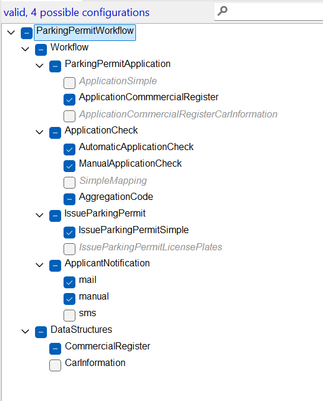
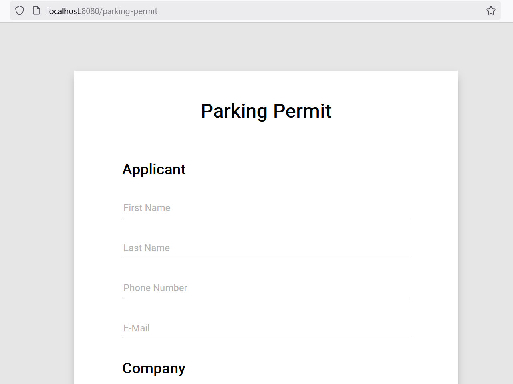
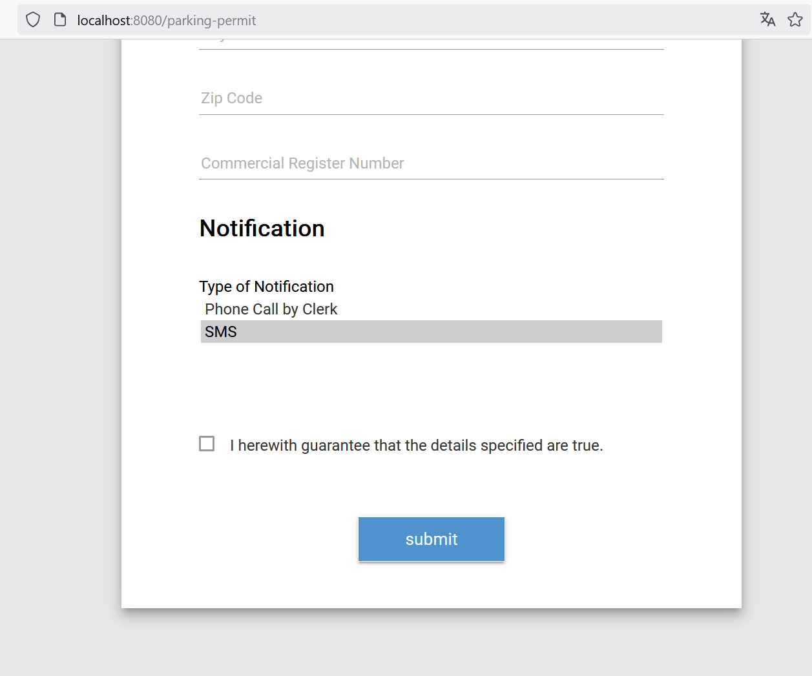
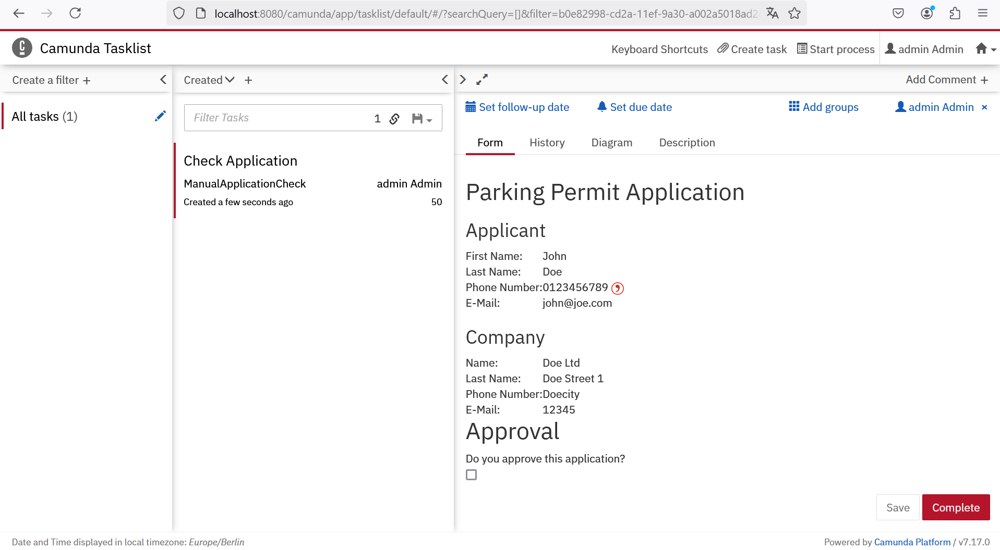

# Business Process Implementation Variability / PAIS Product Line

This repository demonstrates how business process implementation variability can be achieved.

The business process "application for the special parking permit for craftspersons" is implemented using Camunda Platform 7.

Frequently, in German municipalities craftspersons can apply for a special parking permit so that they don't have to buy a parking ticket every time they stop at a customer's premises.

A plugin mechanism in combination with FeatureHouse is used to be able to select implementations for the activities of the business process during compile time, start time, and runtime.

In order to use the project, FeatureIDE needs to be installed. Then, the project can be imported into FeatureIDE as maven project.

## References

* Thüm, T., Kästner, C., Benduhn, F., Meinicke, J., Saake, G., Leich, T., 2014. FeatureIDE: An extensible framework for feature-oriented software
development. Science of Computer Programming 79, 70–85. doi:10.1016/
j.scico.2012.06.002.
* Apel, S., Kästner, C., Lengauer, C., 2009. FEATUREHOUSE: Languageindependent, automated software composition, in: 2009 IEEE 31st International Conference on Software Engineering, pp. 221–231. doi:10.1109/
ICSE.2009.5070523

## Feature Binding at Compile Time

After having imported the project into FeatureIDE, you can open the the configuration file `configs/default.xml`.
In this configuration file, you can select implementations for each variable activity.
Unter the hood, FeatureHouse will compose the corresponding source code of the selected implementations to `src/main/java`.

Then, the project can be compiled.

## Feature Binding at Startup Time

To start the application run the following maven command in the root of the directory.

    mvn spring-boot:run -Dspring-boot.run.arguments=--excludeNotification=notification.mail

Using the spring boot run arguments, implementations of certain activites may be excluded during startup.

## Feature Binding at Runtime
The form for applying for the parking permit can be accessed via `http://localhost:8080/parking-permit`.

In the application form, the applicants can choose how they will be notified by selecting the notification means.
Thereby, variability can be achieved at runtime.

When submitting an application, it can be checked in the Camunda Tasklist via `http://localhost:8080/camunda/app/welcome/default/#!/login`.

username: admin
password: admin

## Detailed Explanation

A detailed explanation about the background, the variability mechanisms, and the usage can be found in the following paper:

* P. Hehnle, M. Reichert, Flexible process variant binding in information systems with software product line engineering, preprint (2024). arXiv:2410.17689. URL https://arxiv.org/abs/2410.17689
* P. Hehnle, M. Reichert, Handling Process Variants in Information Systems with Software Product Line Engineering, in: 2023 IEEE 25th Conference on Business Informatics (CBI), 2023, pp. 1–10.

## License 
[cc-by-nc-nd]: http://creativecommons.org/licenses/by-nc-nd/4.0/

This work is licensed under a
[Creative Commons Attribution-NonCommercial-NoDerivs 4.0 International License][cc-by-nc-nd].